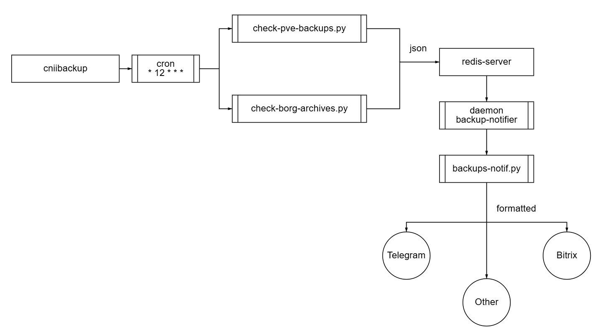

# Система автоматического оповещения о бекапах
Версия сыровата, но работает.
В текущей реализации не все переменные вынесены в конфиг, поэтому, если будете пользоваться скриптами, то правьте переменные
---
## Схема

## Скрипты и конфиги
[Проверка архивов borg](./scripts/check-borg-archives.py)

[Конфиг](./configs/borg-repositories.json)

    В конфиг можно добавить свои репозитории и архивы для проверки.
    После добавления в конфиг они будут автоматически добавлены в отчёт.

[Проверка бекапов ВМ через PVE](./scripts/check-pve-backups.py)

[Конфиг](./configs/properties-pve.json)

    В конфиг можно добавить свои ВМ и storage, в которых скрипт будет искать бекапы
    После добавления в конфиг они будут автоматически добавлены в отчёт

[Формирование и отправка отчётов](/scripts/backups-notif.py)

    В текущей версии конфига нет. Отправка реализована только в телеграмм. Можно реализовать отправку куда угодно, если есть желание

## Права и зависимости
### Python:
    matplotlib
    redis
### Redis-server

### API токен и права на PVE (через shell `pveum acl`)

## Восстановление работы
На Redis-сервере крутится сервис backup-notif.service
вся работы по восстановлению - `systemctl restart backup-notif.service`

В случае, если вы модифицировали скрипт, то читайте логи

Если поменялись репозитории borg или хранилища на PVE - править json конфиги
